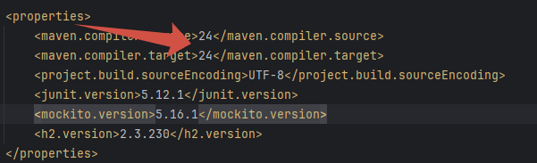

# Maven_JDBC_H2
>Версии ПО:
>
>H2: 2.3.230
> 
>JUNIT: 5.12.1
>
>MOCKITO: 5.16.1

- Склонируйте проект
- При разбработке использовалась Java версии 24, поэтому если у вас Java другой версии может понадобиться поменять версию мавен в pom.xml

- Соберите проект мавен (mvn clean install)
- Запустите тесты (mvn test)
- Unit-тесты: Расположены в src/test/java/com/example/service/
- Интеграционные тесты: src/test/java/com/example/repository/
- Файл schema.sql раположен в папке /resources